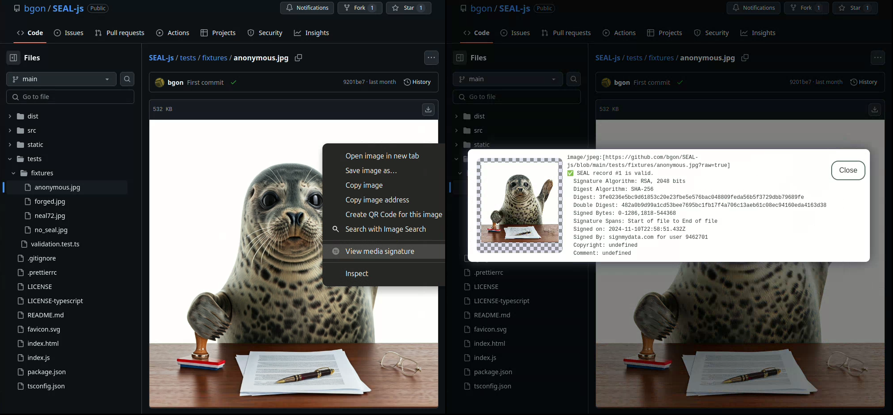

## SEAL-js browser Extension

An extension to inspect attribution of a media signed with [SEAL](https://github.com/hackerfactor/SEAL), using [SEAL-js](https://github.com/bgon/SEAL-js)

Secure Evidence Attribution Label (SEAL) is an open solution for assigning attribution with authentication to media. It can be easily applied to pictures, audio files, videos, documents, and other file formats.



## Roadmap and current status

- ✅ Chrome ([Install unpacked, from dist folder](https://developer.chrome.com/docs/extensions/get-started/tutorial/hello-world#load-unpacked))
- 🚧 Firefox

## Building

### 1. Setup

```npm install```

### 2. Building

```npm run build```
